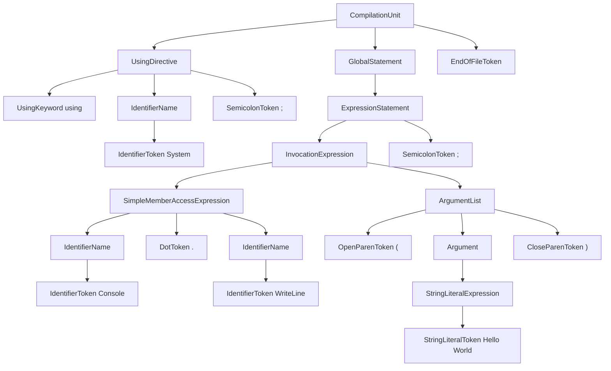

# converter from C# syntax tree to mermaid diagram

This tool converts from C# syntax tree to [mermaid.js diagram.](https://mermaid-js.github.io/mermaid/#/)

nuget package(dotnet tool): https://www.nuget.org/packages/Cs2Mermaid/

# Usage

## Installation

### dotnet global tool

1. install [dotnet sdk 6.0 or later](https://dotnet.microsoft.com/en-us/download)
2. run `dotnet tool install -g Cs2Mermaid`
3. add `$HOME/.dotnet/tools` to your PATH environment variable
4. run `cs2mmd --help` then you will get help message

### single executable binary

1. download zip or tgz binary from [release page](https://github.com/itn3000/Cs2Mermaid/releases)
2. extract binary
3. (if linux or mac) add executable flag to file

# Examples Usage

## Read from file and output to stdout

`cs2mmd -i path/to/cs`

## Read from stdin and output to file

`cat path/to/cs | cs2mmd -o output.mmd`

## Top-Down orientation

`cs2mmd -i path/to/cs --orientation TD`

## parse with Preprocessor

`--pp-symbol` option can be specified multiple.

`cs2mmd -i path/to/cs --pp-symbol ABC --pp-symbol DEF`

## output as markdown with original source(github format)

`cs2mmd -i path/to/cs -o output.md --md-with-source --chart-orientation TD`

Example output is here(please view with raw README)

```csharp
using System;

// this is comment

Console.WriteLine("Hello World");
```


